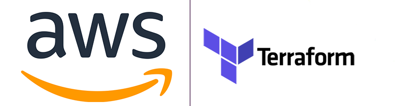

# Terraform for setup new infrastructure on AWS

---

**There is an input of the necessary parameters with the ability to use the default parameters.**

**You need to fill in the parameters in the variables for**
* `./variables.tf`
* `main.tf`

**Terraform must be installed on your machine!**

**What is included in the VPC, Bastion Host and Application Load Balancer setup**
**Infrastructure:**
* 2 VPC
* 4 Subnets (2 public and 2 private)
* Internet gateway, Nat gateway and rout tables
* Security groups for ALB and Bastion Host
* Launch 2 Bastion Host EC2 Instance
* Launch 2 Private Host EC2 Instance

## License
Scripts is Copyright © 2015-2021 Codica. It is released under the [MIT License](https://opensource.org/licenses/MIT).
